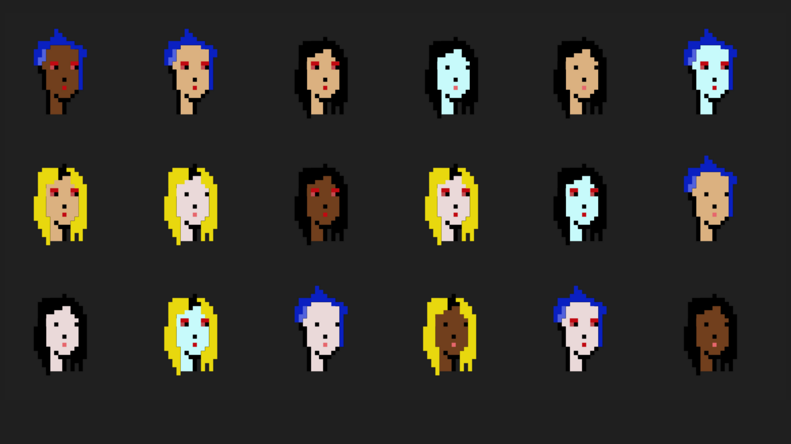
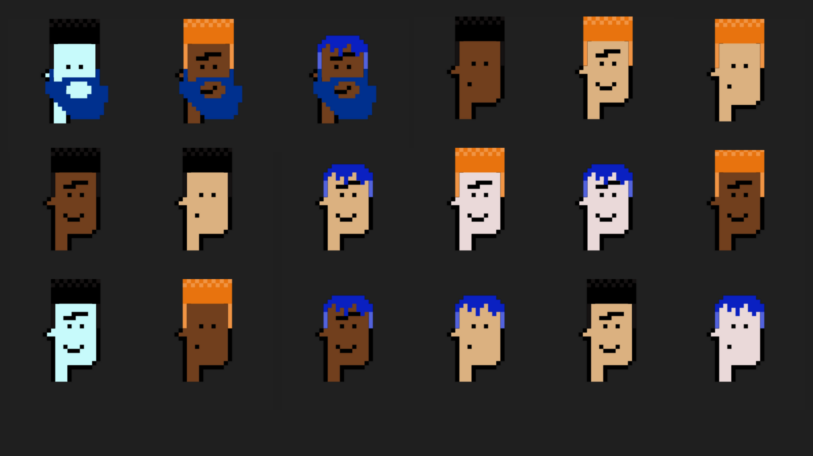
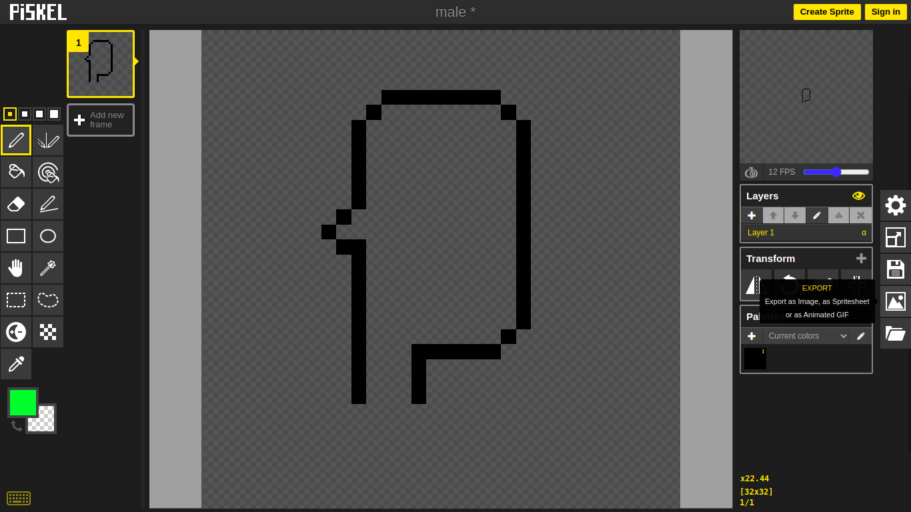
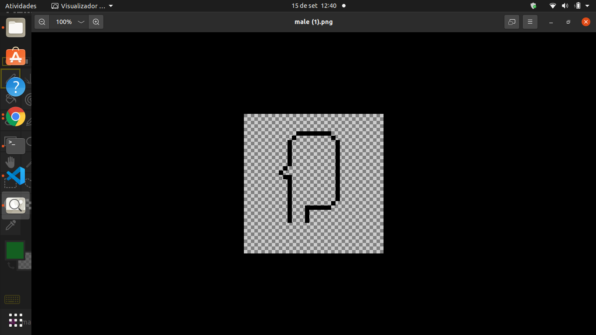
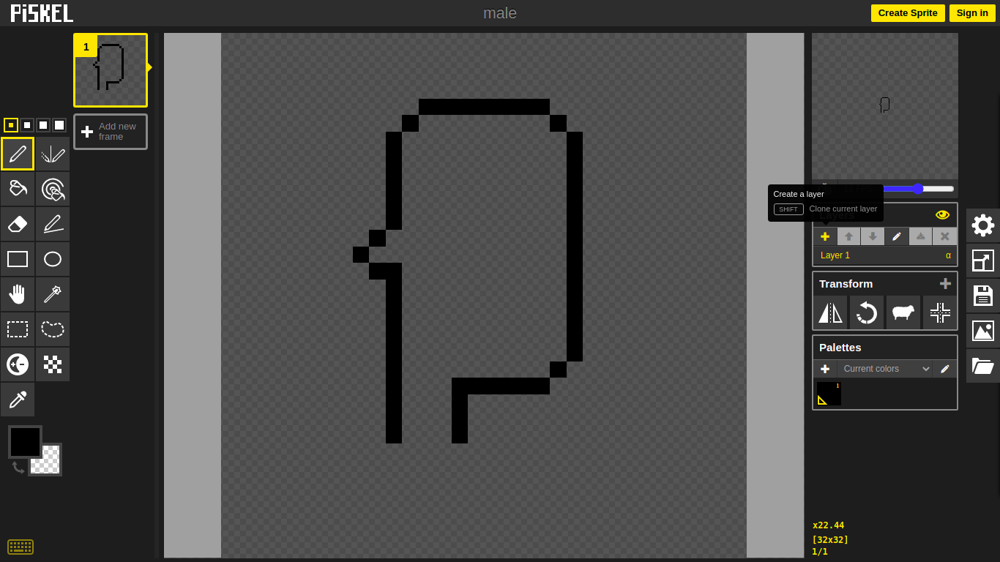
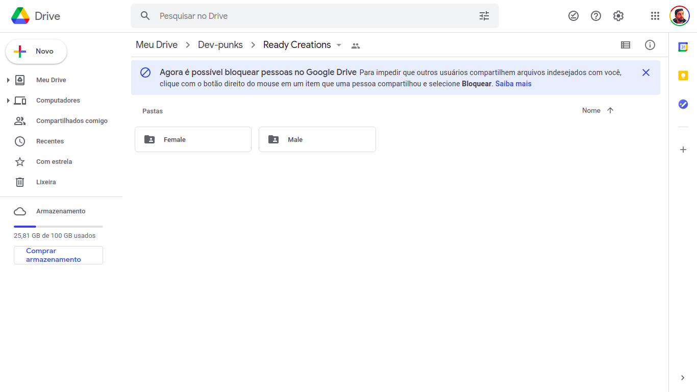

# Devpunks
BDU Generative Art Collaboration
This is for Week 3 of the BDU NFT Course.

# TODO

1. Create Art Layers - alex, streamerd
2. Hardhat project - Smart Contrats - Kedar  (streamerd) ✅
3. Write Minting Script and mint NFTs - Antoine 
4. Generate Metadata - Violeta (Kedar, alex, antoine streamerd, skiing888)
5. Upload Metadata to IPFS and Images to Pinata - steamerd (Kedar, Violeta, Alex, skiing888)
6. Deploy on Testnet - Kedar (antoine, Shu) ✅
7. Deploy on Mainnet - Kedar (antoine, Shu) ✅


# Results You can expect



# What is a way to see this challenge?
You can consider that this challenge has two parts:
- Layers vision (Images)
- Developer vision (Art Engine)

So you can start with any of them: Art Engine or Images.
<br>


# Steps to run 

## Art Engine

Create generative art by using the canvas api and node js. Before you use the generation engine, make sure you have node.js and yarn installed.

## Installation

```sh
git clone 

yarn add all
```

## Usage

Create your different layers as folders in the 'layers' directory, and add all the layer assets in these directories. You can name the assets anything as long as it has a rarity weight attached in the file name like so: `example element#70.png`. You can optionally change the delimiter `#` to anything you would like to use in the variable `rarityDelimiter` in the `src/config.js` file.

*Example:* If you were creating a portrait design, you might have a background, then a head, a mouth, eyes, eyewear, and then headwear, so your `layersOrder` would look something like this:

```js
const layersOrder = [
    { name: 'Background'},
    { name: 'Ball'},
    { name: 'Eye color' },
    { name: 'Iris' },
    { name: 'Shine' },
    { name: 'Bottom lid' },
    { name: 'Top lid' },
];
```

The `name` of each layer object represents the name of the folder (in `/layers/`) that the images reside in. 

Then optionally, update your `format` size, ie the outputted image size, and the `editionSize`, which is the amount of variation outputted.

Make sure you have installed Canvas. You can install this node module by running the following command:

```sh
yarn add canvas@next
```
If for some reason the installation stays in a loop. Try stopping it and execute the command above again.

When you are all ready, run the following command and your outputted art will be in the `build` directory:

```sh
npm run build
```
## Images

In order to have your own generative arts you need to have some layers to use on your Art Engine.

### How can I create some layers?

You can use a free online editor and save your work locally by using: https://www.piskelapp.com/

- Click on Create Sprite and start creating some layers

So now you are able to start creating some layers. Right?

#### Creating layers step by step

If everything went well you will see PiskelApp ready to start creating:


In this case we are going to create two layers:
- Head Layer
- Skin Layer

##### Create your first layer

- Creating Head Layer


- Saving Head Layer

Click on Export button



- Personalize the Scale -> 10x is something that works
- Click on Download


The result



##### Create your second layer

Skin Layer

By clicking on Create a layer



- Creating Skin Layer


- Deleting Head Layer


- Save your Skin Layer

The result


Now you probably have two things: the Art Engine ready to use and your layers. Time to try!

## LAST STEP: Collaborating Folder

There is a public folder where you can:

- Get some "skeleton" to use in your creations (Base folder)
- Save your layers so that they will be considered for the collection (Ready Creations folder). Consider give name to your layers that represents your original inspiration :)

Collaborating Folder: https://drive.google.com/drive/u/0/folders/1oH579VB0AQ5omF8-xYTeGbimGR23-qVp

#### Base folder


#### Ready Creations folder



## Tutorials
Here is a list of useful Tutorials. List Generative Art Tutorials

### Written Tutorials
An introduction to Generative Art: what it is, and how you make it
* https://aiartists.org/generative-art-design - recommends an Edx course
* Generative Art NFTs With Python and Solidity | by Parker Ferguson | Sep, 2021
* Monster Guide to Creating Generative Art NFTs
* https://medium.com/web-design-web-developer-magazine/how-to-prepare-artwork-for-a-generative-nft-programmer-970adf59c042 (NiftyNinja)
* https://www.google.com/url?sa=t&rct=j&q=&esrc=s&source=web&cd=&ved=2ahUKEwil_p_Wif_yAhUHmuAKHdrgA2wQFnoECBMQAQ&url=https%3A%2F%2Fwww.generativehut.com%2Ftutorials&usg=AOvVaw3P0_MscFj6uzWOcQ9t5222
* https://blog.kreechures.com/generative-nfts/
* https://www.linkedin.com/pulse/monster-guide-creating-generative-art-nfts-jillian-hinds-williams
* https://blog.kreechures.com/generative-nfts/

### Youtube Tutorials:

* Code generative art for NFT in node.js part 1MS
* How To Create An ENTIRE NFT Collection (10,000+) In Under 1 Hour Without Coding Knowledge
* How To Create 10,000 Generative Art NFT Like Cryptopunks In 15 Mins with No Coding Experience
* How to make a NFT Project like Crypto Punks or Bored Apes!
* How to Set Up a Generative NFT Art Collection/Project
* How to Create an NFT Collection (10,000+) No Coding Knowledge Needed
* Code a 10000 NFT Minting Dapp part 1
* The Defiant Guide to Art Blocks - Generative art - Good non-technical view of NFTs
🌿 How to mint NFTs directly from the contract | Etherscan tutorial
* Code generative art for NFT in node.js part 2
Jan - Non fungible tokens, EIP 1559 


### Github Repositories:
* Antoine - https://github.com/NotLuksus/nft-art-generator
* Kedar-
https://github.com/HashLips/hashlips_art_engine
* https://github.com/HashLips/nft_collection_minter
* https://github.com/HashLips/generative-art-node
* https://github.com/terkelg/awesome-creative-coding

### Tools
* Generative art tutorial without coding with a free online tool


## Tasks

* Antoine - Research Generative art projects to see how they did it

* Kedar - Execute Generative art program with different images

* Alex - Try your images in the generative art program

* navlar - get Hard Drive to make us some base images

* Everyone - Try tutorials and report back

* Streamerd - Give us some art components we can use

* violeta - research generative music NFT's

* MS - look into AI generative art

## How to collaborate

Tell us your github id in the discord, or make pull requests. Add your work in your own folder please. 
