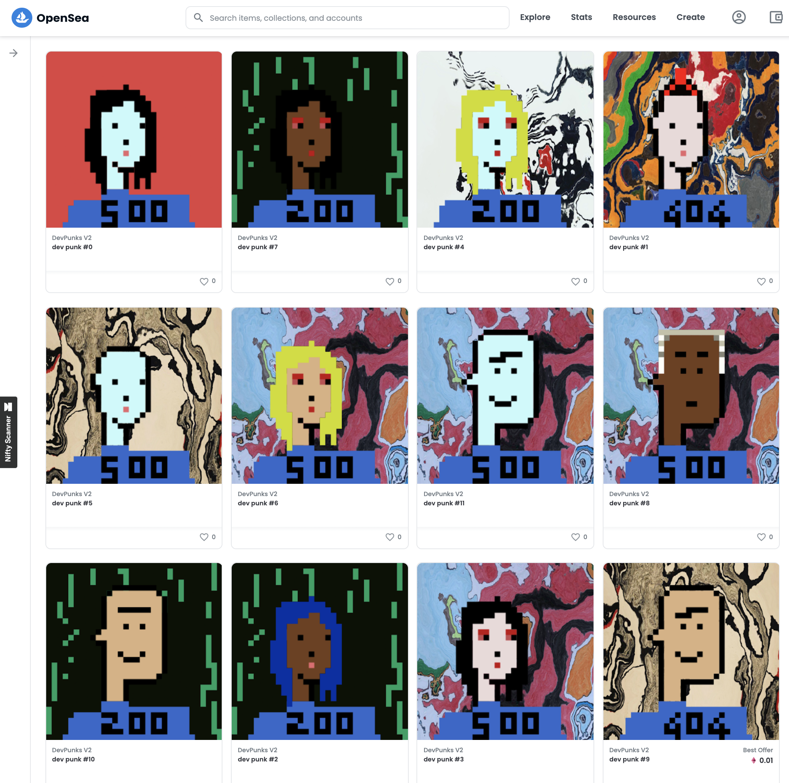
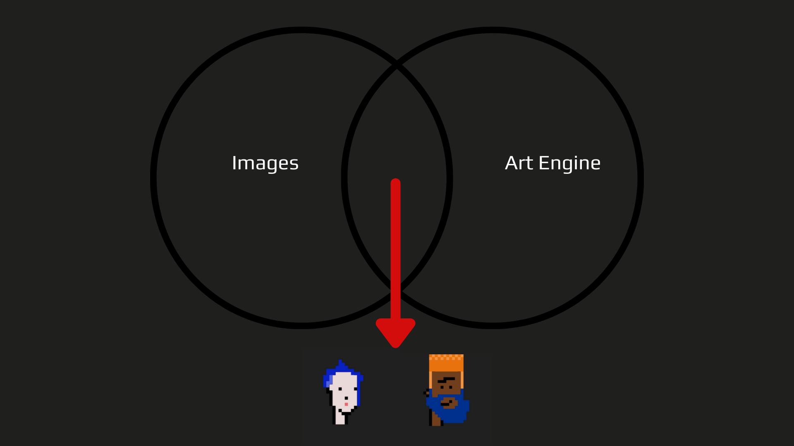
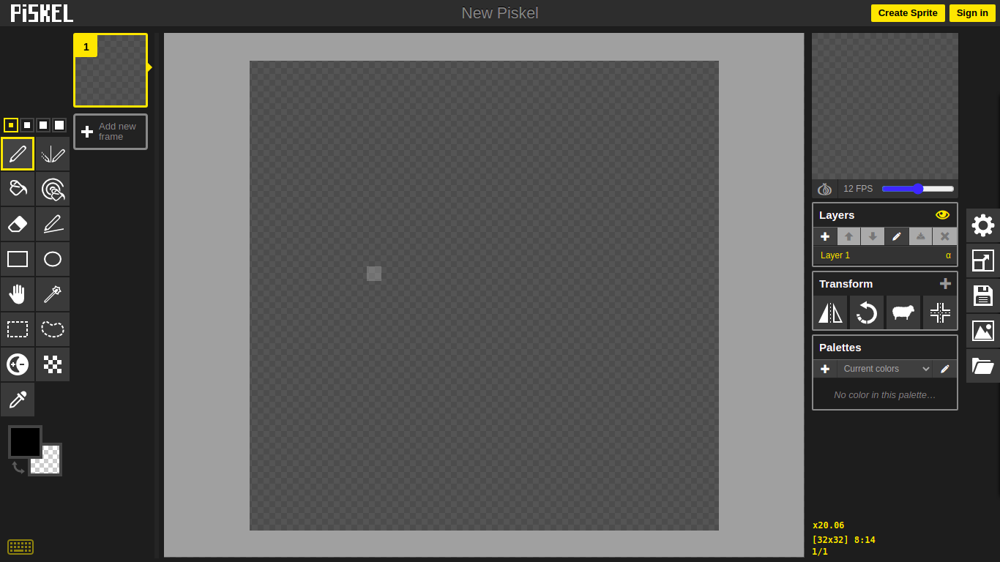
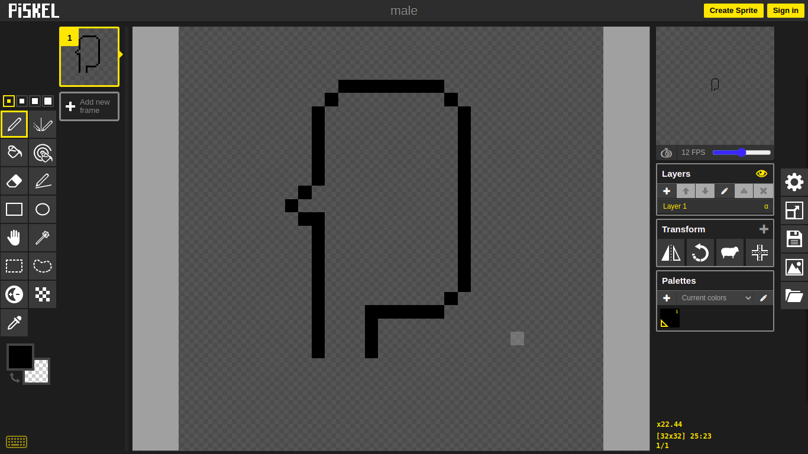
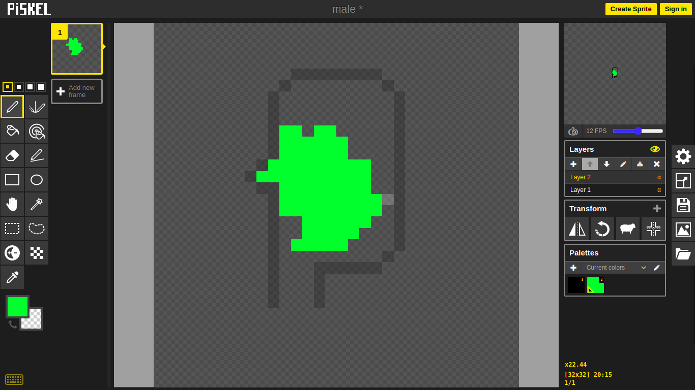
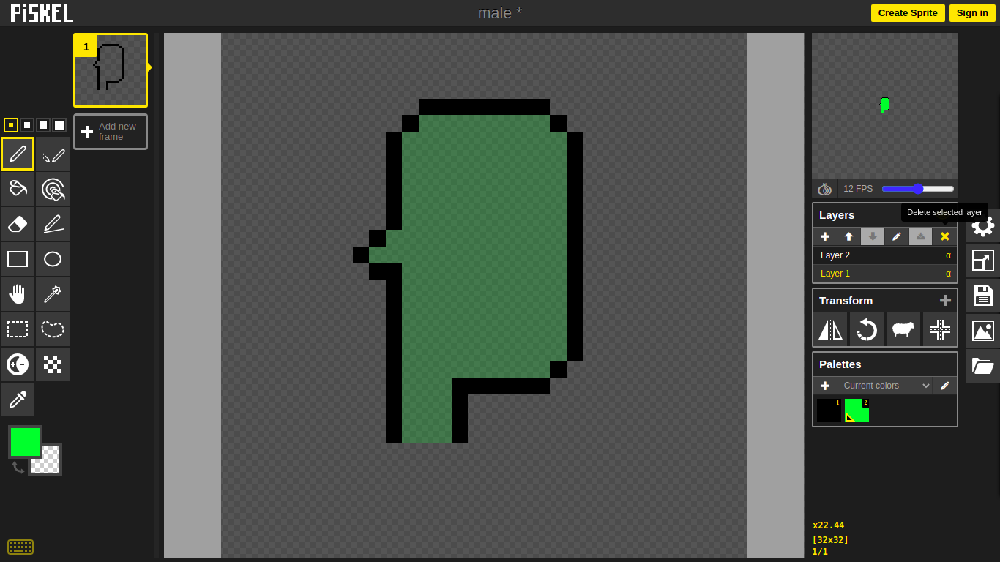
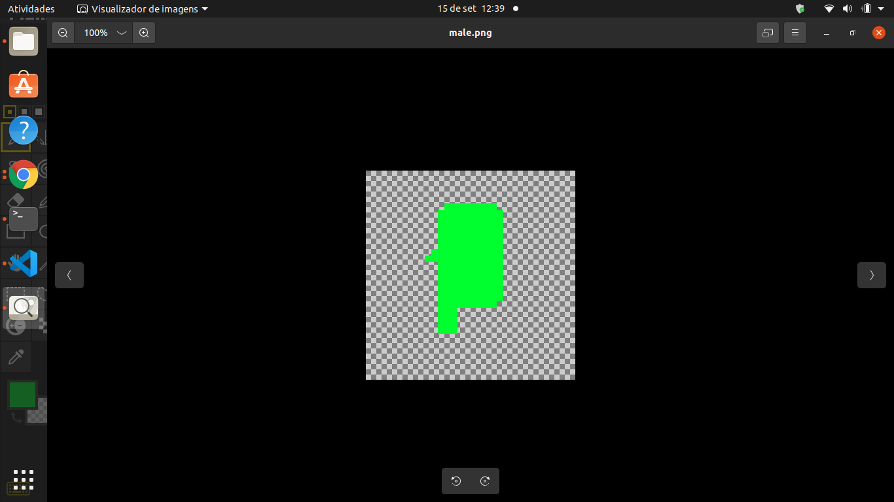

# devPunks
BDU Generative Art Collaboration
----



Mainnet Contract 
---
https://etherscan.io/address/0x430ba37b5c17df284559e653559bfad10e0d248f 
---
(collectively deployed at 3rd week of the BDU NFT Course)

first 12 of devPunks, randomly generated and minted to succeeding course participants. 

https://opensea.io/collection/devpunks-v2

good thing is, you can purchase those punks as their imperfectionist, genesis series. 

or better or build yourself new generations with this tool, all this jazz is for that actually ;) 

don't forget to add your flavour in it and let us know if it was fun to experience it. 

and if you want to join to next course, join our discord and have your place for learning contract development and use of tools for Decentralised Autonomous Organisations,  Decentralised Exchanges following Non-fungible Tokens.

# concept

devPunks; an outcome of a month long collaboration. 

relating devPunks' facial expressions with textual interpretations of HTTP response status codes and how they'd feel in variety of scenarios: 
https://developer.mozilla.org/en-US/docs/Web/HTTP/Status

 HTTP response status codes indicate whether a specific HTTP request has been successfully completed. Responses are grouped in five classes:

    Informational responses (100–199)
    Successful responses (200–299)
    Redirection messages (300–399)
    Client error responses (400–499)
    Server error responses (500–599)

these numbers, appearing to a developer on a daily basis, are used as a common understanding of  system-level communication and basing a documented concensus on client-server setting of systems.

in general, devs incorporate those response/return codes; for systems as they make sense for those particular scenarios.

as is, responseCodes and facialExpressions are not tried to be matched, since  our experiences are not always matching with our reaction. 

random generation in this case, inherently solving that without going deterministic and assumptious at all. 
 
hence, project is opening this to public discussion, and invite all to evolve and grow with more developers, designers, pschologists. 

ome codes are well known, some are not. so here, it's more like that error code, for a techie or non-techie will create bias for purchase/ it'll be self-exploratory.

-----
# story of the collaboration

as part of the NFT programming course, we have distributed and focused our motivation for learning in multiple tasks; from contemplation, design, development and more.

concept development, writing smart contracts, working with metadata and deploying on testnets/mainnet, 

all organised on BlockchainDevsUnited's discord server:
https://discord.gg/gkX2B2MY


1. Create Art Layers - alex, streamerd ✅
2. Hardhat project - Smart Contrats - Kedar, streamerd ✅
3. Write Minting Script and mint NFTs - Antoine ✅
4. Generate Metadata - Violeta (Kedar, alex, antoine streamerd, skiing888)✅
5. Upload Metadata to IPFS and Images to Pinata Violeta (Kedar,  Alex, skiing888)✅
6. Deploy on Testnet - Kedar (antoine, Shu) ✅
7. Deploy on Mainnet - Kedar (antoine, Shu) ✅


# What is a way to see this challenge?
You can consider that this challenge has two parts:
- Layers vision (Images)
- Developer vision (Art Engine)

So you can start with any of them: Art Engine or Images.
<br>


# Steps to run 

## Art Engine

Create generative art by using the canvas api and node js. Before you use the generation engine, make sure you have node.js and yarn installed.

## Installation

```sh
git clone 

npm install --global yarn
yarn add all
```

## Usage

Create your different layers as folders in the 'layers' directory, and add all the layer assets in these directories. You can name the assets anything as long as it has a rarity weight attached in the file name like so: `example element#70.png`. You can optionally change the delimiter `#` to anything you would like to use in the variable `rarityDelimiter` in the `src/config.js` file.

*Example:* If you were creating a portrait design, you might have a background, then a head, a mouth, eyes, eyewear, and then headwear, so your `layersOrder` would look something like this:

```js
const layersOrder = [
    { name: 'Background'},
    { name: 'Ball'},
    { name: 'Eye color' },
    { name: 'Iris' },
    { name: 'Shine' },
    { name: 'Bottom lid' },
    { name: 'Top lid' },
];
```

The `name` of each layer object represents the name of the folder (in `/layers/`) that the images reside in. 

Then optionally, update your `format` size, ie the outputted image size, and the `editionSize`, which is the amount of variation outputted.

Make sure you have installed Canvas. You can install this node module by running the following command:

```sh
yarn add canvas@next
```
If for some reason the installation stays in a loop. Try stopping it and execute the command above again.

When you are all ready, run the following command and your outputted art will be in the `build` directory:

```sh
npm run build
```
## Images

In order to have your own generative arts you need to have some layers to use on your Art Engine.

### How can I create some layers?

You can use a free online editor and save your work locally by using: https://www.piskelapp.com/

- Click on Create Sprite and start creating some layers

So now you are able to start creating some layers. Right?

#### Creating layers step by step

If everything went well you will see PiskelApp ready to start creating:



In this case we are going to create two layers:
- Head Layer
- Skin Layer

##### Create your first layer

- Creating Head Layer



- Saving Head Layer

Click on Export button


- Personalize the Scale -> 10x is something that works
- Click on Download


The result


##### Create your second layer

Skin Layer

By clicking on Create a layer


- Creating Skin Layer



- Deleting Head Layer



- Save your Skin Layer

The result



Now you probably have two things: the Art Engine ready to use and your layers. Time to try!

## LAST STEP: Collaborating Folder

There is a public folder where you can:

- Get some "skeleton" to use in your creations (Base folder)
- Save your layers so that they will be considered for the collection (Ready Creations folder). Consider give name to your layers that represents your original inspiration :)

Collaborating Folder: https://drive.google.com/drive/u/0/folders/1oH579VB0AQ5omF8-xYTeGbimGR23-qVp

#### Base folder


#### Ready Creations folder


## Tutorials
Here is a list of useful Tutorials. List Generative Art Tutorials

### Written Tutorials
* An introduction to Generative Art: what it is, and how you make it: https://www.freecodecamp.org/news/an-introduction-to-generative-art-what-it-is-and-how-you-make-it-b0b363b50a70/
* https://aiartists.org/generative-art-design - recommends an Edx course
* Generative Art NFTs With Python and Solidity: https://betterprogramming.pub/creating-generative-art-nfts-with-python-solidity-a95eaeea515e
* Monster Guide to Creating Generative Art NFTs: https://www.linkedin.com/pulse/monster-guide-creating-generative-art-nfts-jillian-hinds-williams
* https://medium.com/web-design-web-developer-magazine/how-to-prepare-artwork-for-a-generative-nft-programmer-970adf59c042 (NiftyNinja)
* https://www.google.com/url?sa=t&rct=j&q=&esrc=s&source=web&cd=&ved=2ahUKEwil_p_Wif_yAhUHmuAKHdrgA2wQFnoECBMQAQ&url=https%3A%2F%2Fwww.generativehut.com%2Ftutorials&usg=AOvVaw3P0_MscFj6uzWOcQ9t5222
* https://blog.kreechures.com/generative-nfts/
* https://www.linkedin.com/pulse/monster-guide-creating-generative-art-nfts-jillian-hinds-williams
* https://blog.kreechures.com/generative-nfts/

### Youtube Tutorials:

* Code generative art for NFT in node.js part 1: https://www.youtube.com/watch?v=3c2EFpCr_vY
* How To Create An ENTIRE NFT Collection (10,000+) In Under 1 Hour Without Coding Knowledge: https://www.youtube.com/watch?v=UCxA8sDltMY
* How To Create 10,000 Generative Art NFT Like Cryptopunks In 15 Mins with No Coding Experience: https://www.youtube.com/watch?v=ThLoQTh0QUQ
* How to make a NFT Project like Crypto Punks or Bored Apes!: https://www.youtube.com/watch?v=ThLoQTh0QUQ
* How to Set Up a Generative NFT Art Collection/Project: https://www.youtube.com/watch?v=C5CLFpslCTw
* How to Create an NFT Collection (10,000+) No Coding Knowledge Needed: https://www.youtube.com/watch?v=NIJI2_1anqA
* Code a 10000 NFT Minting Dapp part 1: https://www.youtube.com/watch?v=SD1DTrlJeKM
* The Defiant Guide to Art Blocks - Generative art - Good non-technical view of NFTs: https://www.youtube.com/watch?v=vsQQWjaqnBA
* How to mint NFTs directly from the contract | Etherscan tutorial: https://www.youtube.com/watch?v=GZca6HOcPa0
* Code generative art for NFT in node.js part 2: https://youtu.be/tfcqFm86KhE 


### Github Repositories:
* https://github.com/NotLuksus/nft-art-generator
* https://github.com/HashLips/hashlips_art_engine
* https://github.com/HashLips/nft_collection_minter
* https://github.com/HashLips/generative-art-node
* https://github.com/terkelg/awesome-creative-coding

### Tools
* Generative art tutorial without coding with a free online tool


## Tasks

* Antoine - Research Generative art projects to see how they did it

* Kedar - Execute Generative art program with different images

* Alex - Try your images in the generative art program

* navlar - get Hard Drive to make us some base images

* Everyone - Try tutorials and report back

* Streamerd - Give us some art components we can use

* violeta - research generative music NFT's

* MS - look into AI generative art

## How to collaborate

Tell us your github id in the discord, or make pull requests. Add your work in your own folder please. 
